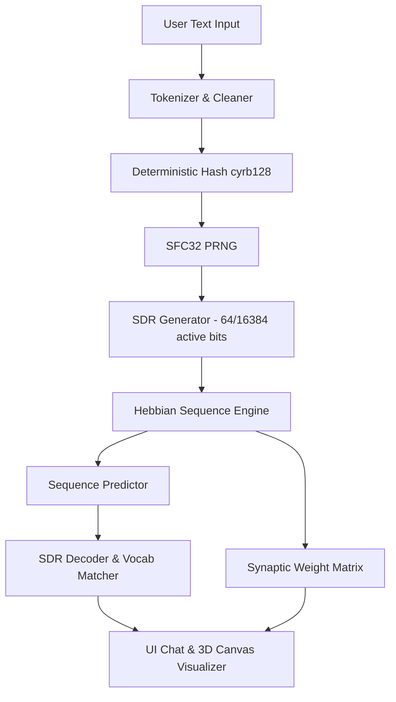

# BIM 2 System Architecture

This document details the software architecture, core mathematical concepts, and algorithms implemented in BIM 2 (Biologically Inspired Model). 

---

## 🏛️ System Overview

BIM 2 is a client-side sequence learning application. The architecture is split into three primary components:

1. **Deterministic Hashing & SDR Generator:** Translates arbitrary text tokens into sparse distributed representations.
2. **Hebbian Sequence Memory Engine:** Learns transitions between SDRs and predicts future states using Hebbian plastic synapses.
3. **3D Fibonacci Sphere Neural Renderer:** A hardware-accelerated 2D canvas visualization of $16,384$ nodes in a rotating 3D space, showing real-time synapse connection lines and activation flows.

---

## 💾 Core Codebase Components

### 1. Deterministic SDR Hashing Pipeline
In biological brains, concepts are represented by Sparse Distributed Representations (SDRs)—where only a small percentage of neurons are active at any given time. In BIM 2, each word is mapped to a sparse vector of size $16,384$ containing exactly $64$ active bits (sparsity $\approx 0.39\%$).

To ensure consistency, this mapping must be deterministic. The application uses a custom hashing pipeline:
1. **Punctuation Stripping:** Cleans input strings using regex: `word.toLowerCase().trim().replace(/[?,.!\(\)]/g, "")`.
2. **cyrb128 Hash:** A 128-bit hash function that generates 4 32-bit integer seeds from the word string.
3. **sfc32 PRNG:** A fast, 32-bit chaotic pseudo-random number generator initialized with the `cyrb128` seeds.
4. **Bit Selection:** Iteratively generates integers in the range $[0, 16383]$ until exactly $64$ unique indices are selected.
5. **Caching:** Active bits are sorted and stored in `sdrCache` (`Map`) to bypass calculations for subsequent lookups of the same word.

### 2. Hebbian Engine (`HebbianEngine`)
The sequence memory is governed by Hebbian learning: *"Cells that fire together, wire together."*

#### Data Structures
* `synapses`: A nested dictionary representing the adjacency list:
  $$\text{synapses}[\text{source\_bit}][\text{target\_bit}] = \text{permanence}$$
  where $\text{permanence} \in [0.0, 1.0]$.
* `vocabulary`: A `Set` tracking all cleaned words processed by the engine.
* `transitionCounts`: A dictionary mapping transition pairs (e.g., `"apple->is"`) to frequency counts.

#### Learning Logic & Forgetting (Synaptic Decay)
When learning a transition from $Word_A$ to $Word_B$:
1. Clean and register both words in the vocabulary.
2. Obtain SDR active bits $SDR_A$ and $SDR_B$.
3. Increment transition counts: $key = \text{"}Word_A \rightarrow Word_B\text{"}$.
4. **Strengthen Active Synapses:** For every source bit $src \in SDR_A$ and target bit $tgt \in SDR_B$, increment the synaptic weight:
   $$\text{permanence}_{new} = \min(1.0, \text{permanence}_{old} + \eta)$$
   where $\eta$ is the learning rate (default $0.34$).
5. **Decay Inactive Synapses (Forgetting):** If the decay rate $\delta > 0$, then for every active source bit $src \in SDR_A$, any previously connected target bit $tgt\_old$ that is *not* active in $SDR_B$ has its weight decayed:
   $$\text{permanence}_{new} = \max(0.0, \text{permanence}_{old} - \delta)$$
   where $\delta$ is the decay rate (default $0.02$).
6. **Synaptic Pruning:** If a synapse's permanence decays to $\le 0.0$, it is completely deleted from the sparse synapse dictionary `synapses[src]` to optimize memory and keep connections highly sparse.

#### Prediction Logic
To predict the next word given a current word:
1. Fetch $SDR_{current}$.
2. Initialize an excitation array of size $16,384$ filled with zeros.
3. For each active bit $src \in SDR_{current}$, retrieve target synapses.
4. If a synapse target $tgt$ has a permanence $\ge \theta$ (connection threshold = $0.50$), add the permanence value to the excitation score:
   $$\text{excitation}[tgt] = \text{excitation}[tgt] + \text{permanence}[src][tgt]$$
5. Sort target indices by excitation and select the top $64$ indices to form the predicted SDR ($SDR_{predicted}$).
6. Calculate the average synapse permanence of the predicted bits:
   $$\text{Average Permanence} = \frac{\sum_{src \in SDR_{current}} \sum_{tgt \in SDR_{predicted}} \text{permanence}[src][tgt]}{64 \times 64}$$

#### SDR Decoding (Reverse Lookup)
To translate the numerical $SDR_{predicted}$ back to a human-readable word:
1. Iterate through each word in the vocabulary.
2. Calculate the intersection (overlap) between the candidate word's SDR and $SDR_{predicted}$ using a fast two-pointer match.
3. Find the candidate word with the highest overlap, provided it meets the minimum threshold:
   $$\text{overlap} \ge 15 \text{ bits}$$

### 3. Fibonacci Sphere 3D Renderer
To display $16,384$ neurons on a standard 2D `<canvas>`, BIM 2 uses a 3D Fibonacci Sphere layout and orthographic projection.

#### Spherical Coordinates Generation
Nodes are mapped using the golden angle ($\Phi \approx 2.399963$ radians):
$$y_i = 1 - \left(\frac{i}{N - 1}\right) \times 2$$
$$r_i = \sqrt{1 - y_i^2}$$
$$\theta_i = i \times \pi(3 - \sqrt{5})$$
$$x_i = \cos(\theta_i) \times r_i$$
$$z_i = \sin(\theta_i) \times r_i$$

#### Rotation & Depth Projection
For each animation frame, coordinates are rotated around the X and Y axes:
* Rotate X:
  $$y' = y \cos(\theta_x) - z \sin(\theta_x)$$
  $$z_{tmp} = y \sin(\theta_x) + z \cos(\theta_x)$$
* Rotate Y:
  $$x' = x \cos(\theta_y) - z_{tmp} \sin(\theta_y)$$
  $$z' = x \sin(\theta_y) + z_{tmp} \cos(\theta_y)$$
* Orthographic Projecting with depth scaling factor $pScale$:
  $$pScale = \frac{z' + 2}{2} \quad (\text{bounds scale between } 0.5 \text{ and } 1.5)$$
  $$px = cx + x' \times \text{scale} \times 1.1$$
  $$py = cy + y' \times \text{scale} \times 1.1$$

#### Visualization States
* **Inactive Nodes:** Small grey-blue squares (`rgba(59, 130, 246, 0.12)`) rendered in a single batch path for speed.
* **Active Synapses (Connection Lines):** Lines drawn between source and target projected points. Colored green-cyan (`rgba(16, 185, 129, alpha)`) if the Hebbian state is `STABLE`, or orange (`rgba(249, 115, 22, alpha)`) if it is `WIRING`.
* **Pulsing Activations:**
  * Previous Active SDR: Violet circles (`rgba(139, 92, 246, 0.7)`).
  * Current Active SDR: Pulsing cyan circles (`#06b6d4`) with shadow blur.
  * Predicted SDR: Bright green circles (`#10b981`) with shadow blur.
* **Interactive Hover States:**
  * Displays a glowing yellow node (`#f59e0b` with 15px shadow blur) when the cursor gets within $25\text{px}$ Euclidean distance of its 2D projected coordinate:
    $$d = \sqrt{(px - mouse_x)^2 + (py - mouse_y)^2}$$
  * Draws a text label next to the node (e.g., `Node #ID`) in `JetBrains Mono` font.
  * Dynamically traces outgoing connections from the hovered node to all target nodes where the synapse permanence meets the connection threshold, rendering them as glowing yellow lines.

---

## ⚙️ Interactive Controls & Sandbox Bindings

To allow real-time parameter tuning, the UI incorporates input range sliders that directly map to the Hebbian Engine instance parameters via event listeners:

1. **Learning Rate Slider (`#lr-slider`):** Updates `engine.learningRate` (bounds: $0.05$ to $1.00$). Higher values lead to faster synapse wiring (reaching `STABLE` in fewer repetitions) but risk fast overwriting.
2. **Connection Threshold Slider (`#threshold-slider`):** Updates `engine.connectionThreshold` (bounds: $0.10$ to $0.90$). Determines the minimum synapse permanence required for target bit excitation. Lowering it increases prediction sensitivity; raising it increases prediction selectivity.
3. **Active Synaptic Decay Slider (`#decay-slider`):** Updates `engine.decayRate` (bounds: $0.00$ to $0.10$). Controls the forgetting rate of unreinforced connections, allowing the network to prune inactive paths in real-time.

---

## 🔄 Sequence Pipeline and Interaction Loop

When the user submits a sentence (e.g., `"A B C"`):
1. The engine splits the sentence into tokens.
2. For each transition (e.g., $A \rightarrow B$, then $B \rightarrow C$):
   * Runs the prediction calculation pre-update to compute the transition surprise:
     $$\text{Surprise} = 1.0 - \left(\frac{\text{overlap}}{64}\right)$$
   * Learns the transition (if not in query mode) and updates active synapse lines.
   * Pause execution for $400\text{ms}$ (`sleep(400)`) to display the visual flow.
3. At the end of the sentence:
   * Performs a multi-step prediction (up to 3 steps). If the predicted word is a common grammatical stop-word (e.g., *is, of, the, to, in, are*), it feeds the prediction back as input to look ahead to the next content word.
   * Displays the final predicted word in the chat panel.
